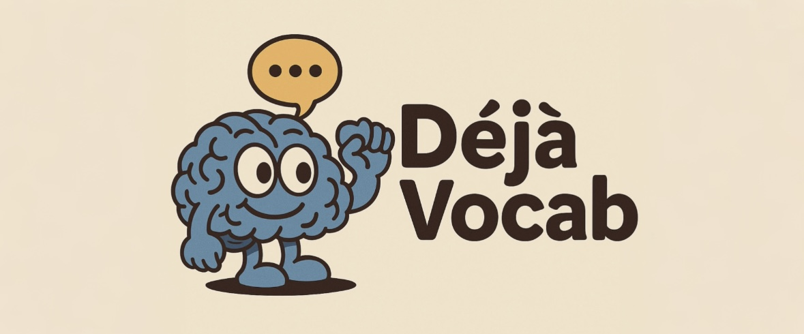

<div align="center">
  <h3>📚 边看喜欢的YouTube视频，边学习语言! 📚</h3>
</div>
<div align="center">
  
  <p>自动收集视频字幕，构建个人词典，AI实时解答问题，边看视频边轻松提升语言能力。</p>
  
  <p>
    <a href="https://chromewebstore.google.com/detail/deja-vocab/fgoacfcjfdnjgiamkgphccmhcieibmgh">
      
    </a>
  </p>
  <p>
    <a href="https://github.com/Stevelonng/OpenDejaVocab/stargazers">
      
    </a>
    <a href="https://github.com/Stevelonng/OpenDejaVocab/network/members">
      
    </a>
    <a href="https://github.com/Stevelonng/OpenDejaVocab/issues">
      
    </a>
    <a href="https://github.com/Stevelonng/OpenDejaVocab/blob/main/LICENSE">
      
    </a>
  </p>
  
  <p>
    <a href="README.md">English</a> | 
    <b><a href="#">中文</a></b>
  </p>
</div>

---
<h3 align="center"><i>旨在打造最强大的语言学习生态系统</i></h3>
## 🚀 快速开始
<details open>
  <summary><b>👆 点击安装</b></summary>
  <ol>
    <li>从<a href="https://chromewebstore.google.com/detail/deja-vocab/fgoacfcjfdnjgiamkgphccmhcieibmgh">Chrome网上应用店</a>安装Déjà Vocab</li>
    <li>打开任何YouTube视频</li>
    <li>将鼠标悬停在字幕中的单词上查看释义</li>
    <li>点击单词听取发音</li>
    <li>双击将单词保存到个人词汇库</li>
    <li>使用AI助手解答任何语言问题</li>
  </ol>
</details>

## ✨ 核心功能

<details open>
  <summary><b>1. 交互式词汇学习</b></summary>
  <ul>
    <li><b>悬停查看释义</b> • <b>点击听取发音</b> • <b>双击保存单词</b></li>
  </ul>
</details>

<details>
  <summary><b>2. 智能视频集成</b></summary>
  <ul>
    <li><b>自动检测已保存单词</b> • <b>上下文展示</b> • <b>一键跳转定位</b></li>
  </ul>
</details>

<details>
  <summary><b>3. AI语言助手</b></summary>
  <ul>
    <li><b>上下文解释</b> • <b>语言指导</b> • <b>个性化帮助</b></li>
  </ul>
</details>


## 📥 安装说明

<details>
  <summary><b>环境要求</b></summary>
  <ul>
    <li>Python 3.9或更高版本</li>
    <li>Node.js和npm</li>
    <li>Chrome浏览器</li>
    <li>Google Gemini API密钥</li>
  </ul>
</details>

<details>
  <summary><b>后端部署</b></summary>
  
  ```bash
  # 克隆代码库
  git clone https://github.com/Stevelonng/OpenDejaVocab.git
  cd OpenDejaVocab
  
  # 安装Python依赖
  pip install -r requirements.txt
  
  # 运行数据库迁移
  cd backend
  python manage.py migrate
  
  # 配置Google Gemini API密钥
  # 打开backend/api/gemini_views.py和backend/api/gemini_default_view.py
  # 将YOUR_API_KEY替换为您的实际密钥
  
  # 启动Django服务器
  python manage.py runserver
  ```
</details>

<details>
  <summary><b>扩展安装</b></summary>
  
  ```bash
  # 进入扩展目录
  cd extension
  
  # 安装依赖
  npm install
  
  # 构建扩展
  npm run build
  
  # 在Chrome中加载:
  # 1. 打开chrome://extensions/
  # 2. 启用开发者模式
  # 3. 点击"加载已解压的扩展程序"并选择dist文件夹
  ```
</details>

## 👥 贡献指南

我们欢迎对Déjà Vocab的贡献！查看我们的[贡献指南](CONTRIBUTING.md)开始参与。

<div align="center">
  
</div>

## ⭐ 星标历史

<a href="https://star-history.com/#Stevelonng/OpenDejaVocab&Date">
  <picture>
    <source media="(prefers-color-scheme: dark)" srcset="https://api.star-history.com/svg?repos=Stevelonng/OpenDejaVocab&type=Date&theme=dark" />
    <source media="(prefers-color-scheme: light)" srcset="https://api.star-history.com/svg?repos=Stevelonng/OpenDejaVocab&type=Date" />
    
  </picture>
</a>

## 📜 许可证

本项目采用Apache License 2.0许可证 - 详情见[LICENSE](LICENSE)文件

## 📬 联系方式

- **项目维护者**: Stevelonng
- **项目仓库**: [https://github.com/Stevelonng/OpenDejaVocab](https://github.com/Stevelonng/OpenDejaVocab)
- **问题报告**: 请使用[GitHub Issues](https://github.com/Stevelonng/OpenDejaVocab/issues)功能报告Bug和功能请求

---

<div align="center">
  <p>如果您觉得Déjà Vocab有用，请考虑在GitHub上给它一个⭐!</p>
  <p>
    <a href="https://github.com/Stevelonng/OpenDejaVocab">
      
    </a>
  </p>
</div>
