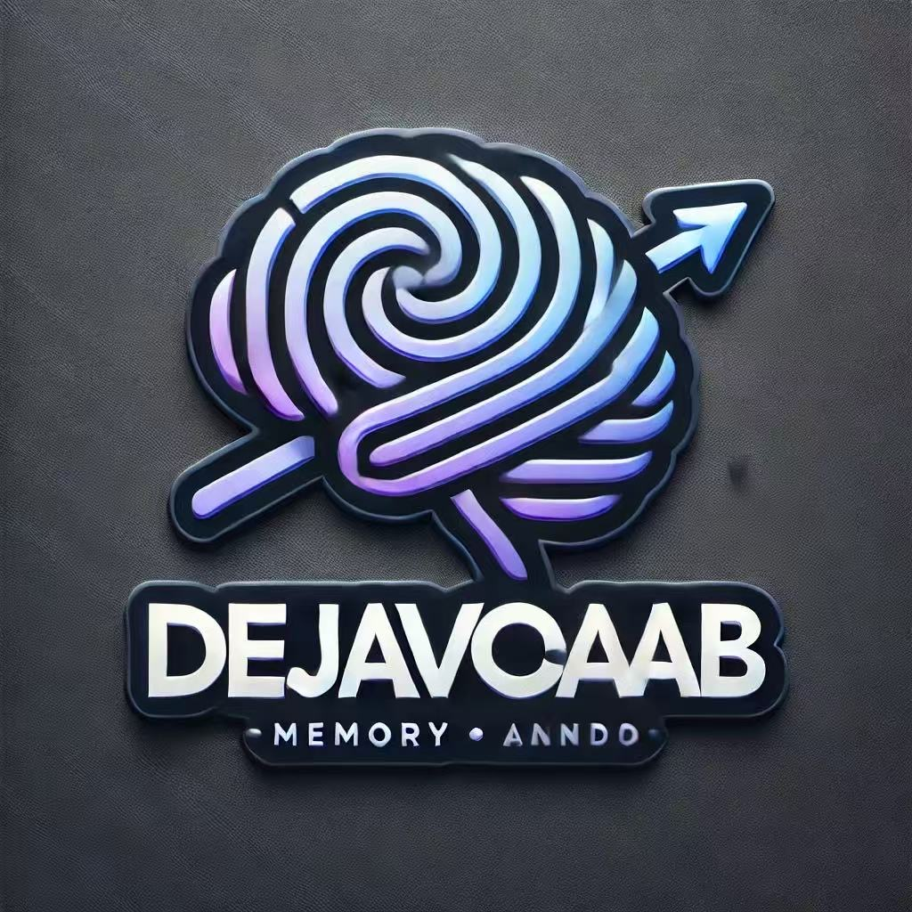

# Déjà Vocab - 旨在做最强的语言学习生态

<div align="center">
  
  <h3>智能YouTube学习助手</h3>
  <p>自动收集视频字幕，构建个人词典，AI实时解答问题，边看视频边轻松提升语言能力。</p>
  
  <p>
    <a href="https://chromewebstore.google.com/detail/deja-vocab/fgoacfcjfdnjgiamkgphccmhcieibmgh">
      
    </a>
  </p>
  
  <p>
    <a href="#项目概述">项目概述</a> •
    <a href="#核心功能">核心功能</a> •
    <a href="#安装说明">安装说明</a> •
    <a href="#使用指南">使用指南</a> •
    <a href="#贡献指南">贡献指南</a>
  </p>
  
  <p>
    <a href="README.md">English</a> | 
    <b><a href="#">中文</a></b>
  </p>
  
  <p><i>全靠Vibe Coding，没有一行是手写的，因为我还不会😭</i></p>
</div>

---

## 项目概述

Déjà Vocab是一款革命性Chrome扩展，将普通的YouTube视频观看转变为强大的语言学习体验。通过智能提取和处理视频字幕，结合先进的AI交互和词汇管理功能，为用户创建沉浸式学习环境，让语言学习变得自然而高效。

无论是观看娱乐视频、教育内容还是纪录片，Déjà Vocab都能帮助您在享受内容的同时，增强词汇量，提高听力理解能力，掌握地道表达。这种结合娱乐与学习的方式，让语言学习不再枯燥，而是成为日常生活的一部分。

## 核心功能

### 1. 交互式词汇学习系统

- **悬停查词**：将鼠标悬停在字幕中的任何单词上，自动显示该单词的释义，包括词性、音标和例句。无需打断视频观看体验，即可快速了解生词含义。
- **点击发音**：单击单词播放其标准发音，帮助学习正确读音，提升听说能力。系统提供清晰、地道的发音参考。
- **双击收藏**：双击任何单词将其立即添加到个人词汇库，系统会自动记录该单词出现的上下文，方便日后复习。已收藏的单词会以特殊样式显示，便于识别。

### 2. 视频相关收藏单词展示

- **自动检测**：进入YouTube视频页面时，自动识别该视频中出现的已收藏单词，帮助您发现之前学习过的单词在新语境中的用法。
- **上下文展示**：显示每个收藏单词在视频中出现的完整句子，而不仅仅是单词本身，帮助理解单词在实际语境中的用法。
- **一键跳转**：点击收藏单词列表中的条目，视频自动跳转到该单词出现的时间点，让您立即看到单词的使用场景，加深理解和记忆。

### 3. 智能字幕处理

- **自动获取字幕**：打开YouTube视频时自动提取并处理字幕内容，无需手动搜索或下载字幕文件。支持多种语言的字幕识别和处理。
- **字幕合并优化**：使用NLP技术合并碎片化字幕，形成更有意义的完整句子，提供更好的阅读和理解体验。
- **自动暂停功能**：可选择在每个字幕片段结束时自动暂停视频，给予足够时间处理和理解当前内容，特别适合初学者使用。

### 4. AI驱动的学习助手

- **双模式聊天**：
  * **默认模式**：每次视频切换自动重置聊天，专注当前内容的学习和理解
  * **累积模式**：保持对话连贯性，跨视频建立学习上下文，适合系统性学习某个主题
- **内容感知互动**：AI助手理解视频内容，能够回答关于视频中特定单词、短语或语法结构的问题，提供相关解释和建议。
- **用户ID绑定**：系统记住用户身份和偏好设置，提供个性化体验，即使在不同设备上使用，也能保持一致的学习进度。

### 5. 沉浸式学习界面

- **全屏学习视图**：视频、字幕、收藏单词和AI助手共存的优化布局，创造专注的学习环境，减少外部干扰。
- **侧边栏模式**：在常规YouTube界面右侧显示学习面板，可随时展开或收起，不影响正常的视频观看体验。
- **响应式设计**：界面自适应不同屏幕尺寸和分辨率，在各种设备上提供一致的用户体验。

## 系统架构

Déjà Vocab由两个主要部分组成：

### 后端（Django REST API）

- **用户认证与管理**：安全的用户注册、登录和个人资料管理系统
- **视频字幕处理**：自动获取、分析和优化YouTube视频字幕
- **词汇提取与管理**：识别、存储和组织用户收藏的单词和句子
- **AI助手集成**：与Google Gemini API集成，提供智能交互和语言学习支持
- **用户学习数据存储**：跟踪和保存用户学习进度、偏好和历史记录

### 前端（Chrome Extension）

- **YouTube页面集成**：无缝融入YouTube界面，增强而不干扰原有体验
- **交互式UI组件**：直观、易用的用户界面，包括弹出式词汇卡片、收藏面板和AI聊天窗口
- **本地数据缓存**：减少网络请求，提高性能，支持离线操作
- **与后端API通信**：安全、高效地传输和同步用户数据

## 安装说明

### Chrome网上应用店安装
Déjà Vocab现已上线Chrome网上应用店！您可以直接从以下链接安装：
[https://chromewebstore.google.com/detail/deja-vocab/fgoacfcjfdnjgiamkgphccmhcieibmgh](https://chromewebstore.google.com/detail/deja-vocab/fgoacfcjfdnjgiamkgphccmhcieibmgh)

### 手动安装与开发
如果您希望手动安装或参与开发，请按照以下步骤操作：

### 后端部署

1. 克隆代码库
   ```bash
   git clone https://github.com/Stevelonng/OpenDejaVocab.git
   cd OpenDejaVocab/backend
   ```

2. 创建虚拟环境
   ```bash
   python -m venv .venv
   source .venv/bin/activate  # Linux/macOS
   # 或 .venv\Scripts\activate  # Windows
   ```

3. 安装依赖
   ```bash
   pip install -r requirements.txt
   python -m spacy download en_core_web_sm
   ```

4. 配置Google Gemini API密钥
   - 打开 `backend/api/gemini_views.py` 文件
   - 找到 `GEMINI_API_KEY = "YOUR_API_KEY"` 行
   - 将 `YOUR_API_KEY` 替换为您的实际Google Gemini API密钥（可从[Google AI Studio](https://makersuite.google.com/app/apikey)获取）
   - 同样在 `backend/api/gemini_default_view.py` 文件中也进行相同的替换

5. 创建和应用数据库迁移
   ```bash
   python manage.py makemigrations
   python manage.py migrate
   ```

6. 创建管理员账户
   ```bash
   python manage.py createsuperuser
   ```
   按照提示输入用户名、电子邮件和密码，创建管理员账户。

7. 运行开发服务器
   ```bash
   python manage.py runserver
   ```
   现在，您可以通过访问 `http://127.0.0.1:8000/` 来访问后端API，以及通过 `http://127.0.0.1:8000/admin/` 访问管理界面。

### 扩展安装

1. 进入扩展目录
   ```bash
   cd ../extension
   ```

2. 安装依赖
   ```bash
   npm install
   ```
   这将自动安装所有必需的依赖项并创建`node_modules`目录

3. 开发模式（生成`.wxt`目录并运行开发服务器）
   ```bash
   npm run dev
   ```
   此命令会启动一个实时更新的开发服务器，任何代码更改都会立即反映在扩展中。
   
   或者构建生产版本
   ```bash
   npm run build
   ```
   这两个命令都会自动生成`.wxt`目录，其中包含扩展的构建文件

4. 加载到Chrome
   - 打开Chrome浏览器，访问`chrome://extensions/`
   - 启用"开发者模式"（右上角的开关）
   - 点击"加载已解压的扩展程序"
   - 选择`dist`目录（如果使用`npm run build`命令）或`.wxt/chrome-mv3`目录（如果使用`npm run dev`命令）

5. 测试扩展
   - 打开任何YouTube视频页面
   - 扩展应自动激活并开始处理字幕
   - 您可以通过点击浏览器工具栏中的扩展图标来访问设置和选项

## 使用指南

1. 安装扩展后，打开任何带有字幕的YouTube视频
2. 扩展将自动激活并加载字幕（页面右侧会出现Déjà Vocab面板）
3. 将鼠标悬停在字幕单词上查看释义（显示词义、音标和例句）
4. 点击单词听取发音（系统会播放标准发音）
5. 双击单词将其添加到收藏（系统会自动记录该单词及其上下文）
6. 使用侧边栏或全屏模式与AI助手交流（可以询问关于语言、单词或视频内容的问题）
7. 在新视频中，查看自动显示的已收藏单词列表（了解之前学过的单词在新语境中的应用）
8. 点击收藏单词旁的时间标记，可以跳转到视频中该单词出现的位置
9. **环境切换**：在扩展面板底部可以切换环境设置
   - **本地开发**（默认）：连接到本地运行的后端服务（http://localhost:8000）
   - **生产环境**：连接到线上部署的服务

## 技术依赖

### 后端

- **Django & Django REST Framework**：提供稳健的API基础设施
- **Google Gemini AI**：驱动智能学习助手功能
- **YouTube Transcript API**：获取和处理视频字幕
- **spaCy NLP**：自然语言处理和文本分析
- **SQLite/PostgreSQL**：数据存储和管理

### 前端

- **Vue.js**：构建响应式用户界面
- **TypeScript**：提供类型安全和开发效率
- **WXT (Web Extension Toolkit)**：简化浏览器扩展开发
- **Vite**：快速的前端构建工具

## 未来增强计划

### 近期计划

- **多语言支持**：添加更多语言之间的翻译能力，支持更广泛的学习者群体
- **智能短语识别**：自动识别重要的短语和习语，而不仅仅是单个单词
- **学习进度追踪**：记录您已学习的视频和短语，提供学习统计和建议

### 中期计划

- **导出/导入功能**：分享单词库或导出供离线学习使用
- **支持其他平台**：扩展支持至Netflix、Bilibili等其他视频平台
- **社区学习功能**：创建一个学习者可以分享笔记和收藏的社区

### 长期愿景

- **个性化学习路径**：基于用户水平和目标自动推荐视频内容
- **语音识别练习**：让用户模仿视频中的发音并获得反馈
- **增强现实集成**：将学习扩展到现实环境中的物体和场景

## 贡献指南

1. Fork项目
2. 创建特性分支 (`git checkout -b feature/amazing-feature`)
3. 提交更改 (`git commit -m 'Add some amazing feature'`)
4. 推送到分支 (`git push origin feature/amazing-feature`)
5. 开启Pull Request

### 代码规范

- 后端代码遵循PEP 8 Python风格指南
- 前端代码遵循ESLint配置的规则
- 所有新功能必须包含相应的测试
- 提交信息应清晰描述更改内容

## 许可证

本项目采用Apache License 2.0许可证 - 详情见[LICENSE](LICENSE)文件

## 联系方式

- 项目维护者: Stevelonng
- 项目仓库: [https://github.com/Stevelonng/OpenDejaVocab](https://github.com/Stevelonng/OpenDejaVocab)
- 问题报告: 请使用GitHub Issues功能报告任何问题或建议
